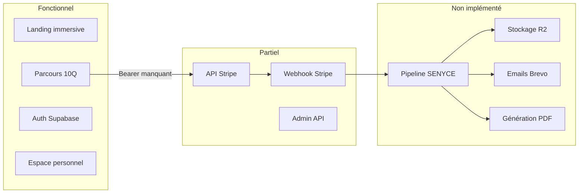

# État des lieux — TOTEM ANCESTRAL

## Vue d'ensemble

**TOTEM ANCESTRAL** est une plateforme web pour **SENYCE PARTNERS** : l'utilisateur répond à un questionnaire narratif (10 questions), choisit une offre, paie via Stripe, puis reçoit un coffret numérique unique (image PNG, audio MP3, parchemin PDF, certificat) généré par un pipeline IA.

| Élément | Détail |
|---|---|
| **Stack active** | Next.js 16 (App Router), React 19, TypeScript, Tailwind 4, next-intl, Supabase, Stripe |
| **Déploiement** | Vercel — [totemancestrale.vercel.app](https://totemancestrale.vercel.app) |
| **Repo** | [REBCDR07/totem-project](https://github.com/REBCDR07/totem-project.git) |
| **État global** | MVP front riche (~70 %), backend transactionnel partiel (~30 %), pipeline métier quasi absent |
| **Héritage** | Migré depuis TanStack Start / Lovable / Cloudflare — code legacy encore présent dans [`src/routes/`](src/routes/) |

---

## Ce qui fonctionne déjà

### M1 — Présentation et expérience immersive (avancé)

- **Landing one-pager** complète : Hero, geste, manifeste, œuvre, expérience, offres, maison, avis, CTA final — [`src/components/sections.tsx`](src/components/sections.tsx), [`src/components/home/HomePage.tsx`](src/components/home/HomePage.tsx)
- **Intro vidéo** jouée une fois par session — [`IntroExperience`](src/components/IntroExperience.tsx)
- **Audio ambiant** avec contrôle utilisateur — [`AmbientAudio`](src/components/AmbientAudio.tsx)
- **Visite guidée** modale — [`SiteTourModal`](src/components/SiteTourModal.tsx)
- **Animations** Motion + GSAP, particules dorées, révélations au scroll
- **Header/Footer** responsive avec switch FR/EN sans rechargement — [`Header.tsx`](src/components/Header.tsx)
- **Pages secondaires** : offres, FAQ, à propos, mentions, CGV, confidentialité (contenu surtout en français)

### M2 — Parcours conversationnel (avancé)

- **10 questions** avec choix A–D, champs libres, Q6 skippable — [`ParcoursPage.tsx`](src/components/questionnaire/ParcoursPage.tsx)
- Barre de progression, transitions animées, nudges griot
- Persistance `localStorage` (`totem_parcours_v1`)
- Auth obligatoire à l'entrée (redirect `/auth?mode=signup`)
- Paywall 3 offres après Q10 : Origine 49€, Ancestral 89€, Famille 199€
- Traductions FR/EN via [`messages/fr.json`](messages/fr.json) et [`messages/en.json`](messages/en.json)

### M6 — Authentification et espace personnel (partiel avancé)

- **Supabase Auth** : signup/signin email+mot de passe, magic link OTP, reset password — [`AuthClient.tsx`](src/components/account/AuthClient.tsx)
- **Dashboard utilisateur** : commandes, œuvres, profil, statuts de composition — [`DashboardClient.tsx`](src/components/account/DashboardClient.tsx)
- **APIs protégées** par JWT Bearer : `/api/commandes`, `/api/oeuvres`, `/api/profiles` — [`server-auth.ts`](src/lib/server-auth.ts)
- **Schéma DB** avec RLS : `profiles`, `user_roles`, `reponses_parcours`, `commandes`, `oeuvres` — [`supabase/migrations/`](supabase/migrations/)

### M3 — Paiement Stripe (API côté serveur)

- **`/api/checkout`** : création session Stripe Checkout réelle, `automatic_tax`, metadata Q1–Q10, upsert réponses — [`checkout/route.ts`](src/app/api/checkout/route.ts)
- **`/api/webhook-stripe`** : vérification signature HMAC (`constructEvent`), création `commandes` + `oeuvres`, déclenchement pipeline — [`webhook-stripe/route.ts`](src/app/api/webhook-stripe/route.ts)
- Rate limiting sur checkout — [`rate-limit.ts`](src/lib/rate-limit.ts)
- Clients Stripe/Supabase/R2/Brevo configurés — [`src/lib/clients/`](src/lib/clients/)

### M7 — Admin (API)

- **`/api/admin/stats`** et **`/api/admin/commandes`** : auth Bearer + vérification rôle `admin` via `user_roles`
- Page `/admin` avec stats et liste commandes — [`src/app/admin/page.tsx`](src/app/admin/page.tsx)

### Infrastructure

- **i18n** next-intl : locales `fr`/`en`, préfixe obligatoire, middleware — [`middleware.ts`](middleware.ts)
- **Headers sécurité** partiels : X-Frame-Options, nosniff, Referrer-Policy — [`next.config.ts`](next.config.ts) (modifié, non commité)
- **Schéma env typé** Zod — [`src/lib/env.ts`](src/lib/env.ts)
- **Scripts** : `dev`, `build`, `type-check`, `lint`, `i18n:check/sync`, `format`
- **Documentation interne** : [`Architecture.md`](Architecture.md), [`features.md`](features.md), [`DEPLOY.md`](DEPLOY.md), [`User.md`](User.md), [`Regles.md`](Regles.md)

---

## Ce qui reste à faire

### Bloquants critiques (empêchent le flux bout-en-bout)

| Priorité | Problème | Fichiers concernés |
|---|---|---|
| **P0** | **Checkout UI sans Bearer token** — `chooseOffer()` appelle `/api/checkout` sans `Authorization: Bearer`, l'API exige `authenticateRequest` → 401 probable en prod | [`ParcoursPage.tsx:557`](src/components/questionnaire/ParcoursPage.tsx), [`checkout/route.ts`](src/app/api/checkout/route.ts) |
| **P0** | **Pipeline IA non fonctionnel** — `generateCoffret()` met le statut `en_generation` puis s'arrête ; aucun appel SENYCE, pas de PDF, pas de livraison | [`pipeline.ts`](src/lib/services/pipeline.ts), [`email.ts`](src/lib/services/email.ts), [`pdf.ts`](src/lib/services/pdf.ts), [`storage.ts`](src/lib/services/storage.ts) |
| **P0** | **Fallback paiement simulé** — si pas de `checkoutUrl`, `createLocalOrder()` écrit dans `localStorage` (invisible dans Supabase) | [`ParcoursPage.tsx`](src/components/questionnaire/ParcoursPage.tsx), [`local-auth.ts`](src/lib/local-auth.ts) |

### M3 — Paiement (compléments)

- Corriger le câblage Bearer token côté UI
- Retirer `createLocalOrder` du flux production
- Idempotence webhook explicite (gestion doublons `stripe_session_id`)
- Email de confirmation post-paiement (Brevo)
- Offre **Famille** (3 coffrets distincts) — non implémentée
- Contrainte UNIQUE manquante sur `(user_id, session_id)` pour upsert `reponses_parcours`

### M4 — Pipeline de génération IA

- Intégration APIs SENYCE (texte, image, audio) via `SENYCE_API_*`
- Génération PDF parchemin + certificat — `@react-pdf/renderer` installé mais stub
- Retry avec backoff (squelette présent dans `pipeline.ts`)
- Table `erreurs_pipeline` absente du schéma
- Option `TOTEM_BACKEND_URL` pour déléguer à un orchestrateur NestJS externe

### M5 — Stockage et livraison

- Upload fichiers sur **Cloudflare R2** — client configuré, service `throw`
- URLs signées 30j pour PDFs
- Emails Brevo : confirmation, livraison, alerte admin — 3 fonctions stub
- Livraison sous 15 minutes (objectif produit)

### M1/M2 — Compléments front

- **Formulaire contact** : UI simule l'envoi (`setSent(true)`), API valide Zod sans Brevo — [`ContactPage.tsx`](src/components/pages/ContactPage.tsx), [`contact/route.ts`](src/app/api/contact/route.ts)
- **Bandeau cookies RGPD** — absent (mentionné dans politique confidentialité)
- **i18n pages secondaires** : FAQ, offres, légal, contact en français hardcodé
- **SEO localisé** : metadata globale FR, pas de hreflang complet
- **API `/api/parcours/reponses`** existe mais l'UI ne l'appelle pas (seul localStorage + upsert au checkout)
- **Protection routes** : pas de middleware auth sur `/espace-personnel` ni `/admin`

### M7 — Admin (compléments)

- Middleware/garde sur la page `/admin`
- Graphiques Recharts (dépendance installée, non utilisée)
- Relance pipeline, exports, filtres avancés
- Journalisation accès admin

### Sécurité et conformité

- **HSTS** et **CSP** manquants dans `next.config.ts`
- Rate limiting en mémoire inefficace sur Vercel serverless
- Variables env R2/Brevo/SENYCE optionnelles en prod
- Pas de bandeau RGPD

### Qualité et DevOps

| Élément | État |
|---|---|
| Tests unitaires/intégration/E2E | **0 fichier** — aucun script `test` |
| CI GitHub Actions | **Absent** |
| `.env.example` | **Absent** (référencé dans `.gitignore` mais non créé) |
| `README.md` | **Absent** |
| Staging | **Non observé** — déploiements directs sur `main` |
| Monitoring (Sentry, Analytics) | **Non intégré** |

### Dette technique

- **Documentation obsolète** : [`features.md`](features.md) et [`Architecture.md`](Architecture.md) datés du 2026-06-08 décrivent checkout/webhook/admin comme placeholders alors qu'une partie est implémentée
- **Code legacy TanStack** : 14 routes dans [`src/routes/`](src/routes/), `vite.config.ts`, `wrangler.jsonc` — exclus du build mais toujours présents
- **`local-auth.ts`** : vestige auth localStorage encore utilisé en fallback paiement
- Double lockfile (`package-lock.json` + `bun.lock`)
- `recharts` et `@react-pdf/renderer` installés sans usage métier

### Phase 2+ (hors périmètre MVP)

- Vidéo dynamique, abonnement TOTEM VIVANT
- Langues PT/ES/AR/ZH
- App mobile native, microservices pipeline

---

## Synthèse par module MVP

| Module | État | Avancement estimé |
|---|---|---|
| M1 Présentation | Avancé | ~85 % |
| M2 Parcours | Avancé (lacunes checkout) | ~75 % |
| M3 Paiement | Partiel (API OK, UI cassée) | ~50 % |
| M4 Pipeline IA | Squelette | ~10 % |
| M5 Stockage/livraison | Squelette | ~5 % |
| M6 Auth/espace perso | Partiel avancé | ~70 % |
| M7 Admin | Partiel (API OK, page non protégée) | ~40 % |
| Sécurité | Partiel | ~40 % |
| Tests/CI | Absent | 0 % |

---

## Feuille de route recommandée

1. **Corriger le Bearer token** sur l'appel checkout UI + supprimer le fallback `localStorage` en prod
2. **Mettre à jour la documentation** (`features.md`, `Architecture.md`) pour refléter l'état réel
3. **Implémenter le pipeline bout-en-bout** : SENYCE → PDF → R2 → Brevo (cœur métier)
4. **Brancher le formulaire contact** à Brevo
5. **Ajouter contrainte UNIQUE** `reponses_parcours` + idempotence webhook
6. **Protéger les routes** `/admin` et `/espace-personnel` au middleware
7. **Mettre en place CI** (lint, type-check, build) puis tests E2E critiques
8. **Durcir la sécurité** (HSTS, CSP, env obligatoires prod)
9. **Nettoyer le legacy** TanStack et `local-auth` du flux prod
10. **i18n complet** des pages secondaires + bandeau RGPD

---

## Fichiers clés à connaître

- Routes : [`src/app/`](src/app/)
- API : [`src/app/api/`](src/app/api/)
- Parcours : [`src/components/questionnaire/ParcoursPage.tsx`](src/components/questionnaire/ParcoursPage.tsx)
- Auth serveur : [`src/lib/server-auth.ts`](src/lib/server-auth.ts)
- Pipeline : [`src/lib/services/pipeline.ts`](src/lib/services/pipeline.ts)
- Migrations DB : [`supabase/migrations/`](supabase/migrations/)
- État produit (à mettre à jour) : [`features.md`](features.md)
